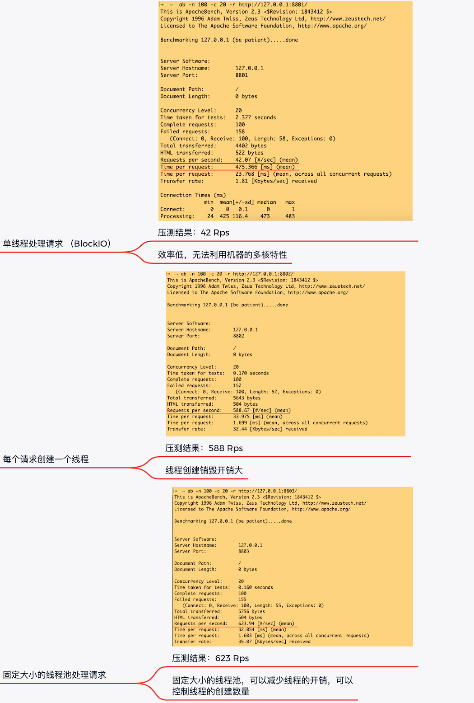
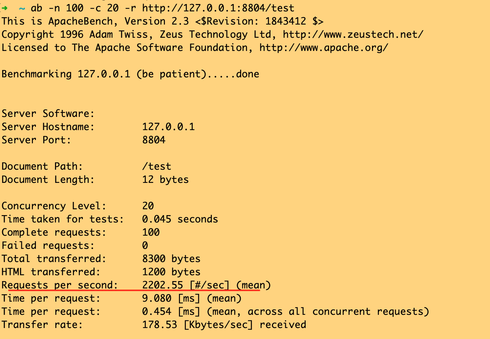

## Week02 Netty 作业
1.（选做）运行课上的例子，以及 Netty 的例子，分析相关现象。

|  HttpServer方案   | Rps  |
|  ----  | ----  |
| 单线程处理请求  | 42 |
| 每次请求创建一个新线程  | 588 |
| 固定大小线程池处理请求  | 623 |
| 使用Netty实现  | 2202 |

Netty测试：

2.（必做）写一段代码，使用 HttpClient 或 OkHttp 访问 http://localhost:8801 ，代码提交到 Github。
 
 [See SimpleHttpClient.java](SimpleHttpClient.java)